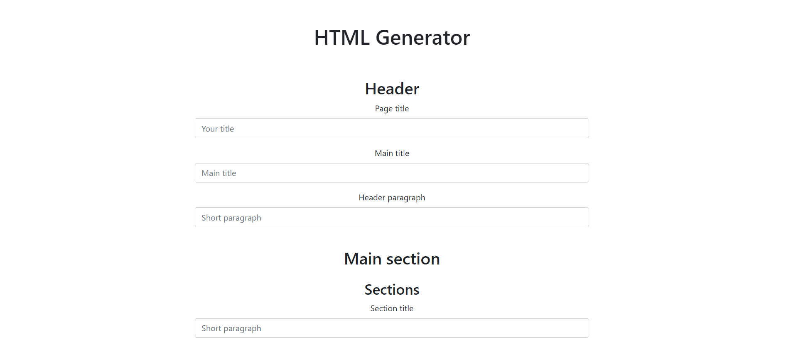

[python-download]: https://www.python.org/downloads/
[django-link]: https://www.djangoproject.com/


<h1 align=center>HTML Generator</h1>

<p align="center">
    
</p>

An interface from where you can write the text and with just a button, it will generate an HTML web page. This is useful for creating rapid online documentation of projects.

### Built with


## :hammer: Getting started

### Pre requisites

- [Python][python-download] - 3.9 or up
- [Django][django-link] - 4.0.1


### Installation

#### Clone the project

```
git clone https://github.com/amssdias/html_generator
cd html_generator
```


#### Install dependencies & activate virtualenv

1. Pipenv ***(make sure you have [Python][python-download] installed)***:

	```python
     pip install pipenv  # For Windows
     brew install pipenv # For MacOs
     sudo apt install pipenv # For Debian Buster+
     sudo dnf install pipenv # For Fedora

    ```
    
2. Install packages:

	```python
    pipenv install # will create a virtual environment with all the modules needed
    ```

3. Activate virtualenv:

	```python
    pipenv shell # To activate the virtual environment

    ```

If any doubts here's a link to some more explanations: [Pipenv](https://pipenv-fork.readthedocs.io/en/latest/basics.html)


## :mag_right: Usage


```python
pipenv shell
python manage.py runserver
```

Paste this link on your browser:
**http://127.0.0.1:8000/**

